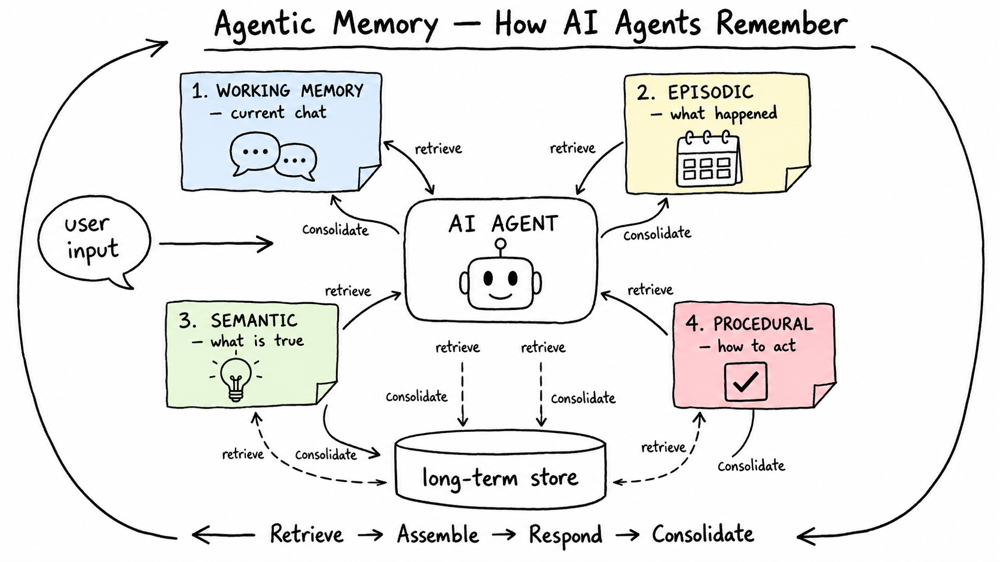

# Agentic Memory: Teaching AI Agents to Remember

*Why AI models forget everything, and how to fix it - with a runnable [Jupyter notebook](agentic_memory_tutorial.ipynb) you can follow along with.*



---

## The problem

Tell an AI assistant your name, then open a new chat and ask "what's my name?" It has no idea.

This is not a bug. **Every large language model is stateless.** Each API call starts from zero — the model only knows what your application puts into that one request. Nothing carries over on its own.

An agent that forgets your preferences, repeats its old mistakes, and asks you the same questions every session isn't much of an agent. **Agentic memory** is the set of patterns that fixes this. It answers four questions:

1. **What** should the agent store?
2. **Where** should it store it?
3. **When** should it write it?
4. **How** does the right information get back into the prompt at the right time?

---

## The big idea: memory is about building prompts, not databases

Here's the key insight before anything else: **agent memory is not a database problem.** You can store everything in a plain JSON file and it works fine.

The hard parts are:

- **The write policy** — deciding what is worth keeping. If you store everything, retrieval drowns in noise.
- **The read policy** — deciding what earns a spot in the prompt *right now*. The context window is limited and expensive.

Everything an agent "remembers" is just text your code chose to put back into the prompt. Get that selection logic right and a flat file is enough. Get it wrong and no fancy vector database will save you.

---

## The four types of memory

Agent memory borrows its names from how human memory works:

```
                        AGENT MEMORY
                             │
            ┌────────────────┴────────────────┐
            │                                 │
     SHORT-TERM MEMORY                 LONG-TERM MEMORY
     (the current chat)                (survives restarts)
            │                                 │
            │                   ┌─────────────┼──────────────┐
            │                   │             │              │
      Conversation           EPISODIC      SEMANTIC      PROCEDURAL
      history               "what          "what           "how
                             happened"      is true"        to act"
```

### 1. Working memory (short-term)

The conversation happening right now — the list of messages you resend with every API call. This is the only memory the model gets for free, and it disappears when the chat ends.

It also has a size problem: long conversations overflow the context window (or your budget). So working memory needs management:

- **Sliding window** — keep only the most recent turns, drop the oldest ones.
- **Compaction** — have the model summarize the old turns into a short recap, and keep only recent turns word-for-word.

### 2. Episodic memory — *what happened*

Memories of specific past events, like a human remembering "last Tuesday we fixed that login bug together."

For an agent, this means **saving a summary of each session** when it ends. Each saved episode gets:

- a **summary** of what happened,
- a **timestamp** (so newer memories can rank higher),
- an **importance score** from 1–10, assigned by the model ("how likely is this to matter later?"),
- **keywords** for finding it again.

When a new session starts, the most relevant past episodes get pulled back into the prompt.

### 3. Semantic memory — *what is true*

Plain facts, separate from when you learned them: *"User is a data engineer in Colombo. Uses React and Tailwind. Doesn't like semicolons."*

The pipeline is simple: **extract → deduplicate → save → recall.** After a session, an LLM call pulls out the facts worth keeping. The extraction prompt matters a lot — a good one skips small talk and one-time requests, and keeps only facts that will be useful in *future* conversations.

One rule: **one fact per record.** Small, atomic facts are easy to deduplicate, easy to update when they change, and easy to delete.

### 4. Procedural memory — *how to act*

The most overlooked type, and maybe the most valuable. Procedural memory stores learned **behavior** — rules built from user feedback.

The user says: *"Stop giving me three options every time, just pick one."* That becomes a permanent rule, added to every future system prompt. The agent never makes that mistake again.

The tricky part is the update step. New feedback shouldn't just get appended to a growing list — an LLM should **reconcile** it with the existing rules: merge similar ones, fix contradicted ones, and keep the list short.

### Two questions that shape every design

| Question | The options |
|---|---|
| **How long does it live?** | Dies with the session vs. survives across sessions |
| **Who decides what to save?** | Your code (fixed pipeline) vs. the model itself (its own judgment) |

---

## How the pieces fit together

A memory-enabled agent wraps four steps around every LLM call:

```
 user input
     │
     ▼
 1. RETRIEVE     pull relevant memories from every store
     │           (facts + past episodes + learned rules)
     ▼
 2. ASSEMBLE     build the prompt:
     │           system prompt = persona + rules + recalled memories
     │           messages = the current conversation
     ▼
 3. RESPOND      the model answers the user
     │           (it may also read/write memory using a tool)
     ▼
 4. CONSOLIDATE  after the response:
                 - extract new facts        → semantic store
                 - session ended?           → save an episode
                 - user gave feedback?      → update the rules
```

**Retrieve → Assemble → Respond → Consolidate.** That's the whole architecture. Every section of the notebook builds one of these boxes.

---

## Which memories make the cut? The scoring formula

You can't put everything in the prompt. Context space is limited, and irrelevant memories don't just waste tokens — they actively confuse the model.

The standard answer comes from Stanford's *Generative Agents* paper (Park et al., 2023). Score every memory on three things and add them up:

> **score = relevance + recency + importance** (each with its own weight)

- **Relevance** — how related is this memory to what the user is asking right now? (Use embeddings in production; simple keyword matching works for prototypes.)
- **Recency** — newer memories score higher. Old ones fade with time, like human memory.
- **Importance** — the 1–10 rating given when the memory was saved. Some things just matter more.

The weights are a product decision. A personal assistant should favor recency (this morning's request matters most). A coding assistant should favor relevance (last month's debugging session on *this exact file* beats yesterday's small talk).

Nice bonus: this formula gives you **forgetting for free**. Memories whose scores decay below a threshold simply stop being retrieved.

---

## Who writes the memories: your code or the model?

There are two answers to "who decides what gets remembered?"

**Application-driven:** your code runs a fixed pipeline — extract facts after every session, summarize on a schedule, update rules when the user gives feedback. Predictable and consistent.

**Agent-driven:** you give the model a **memory tool** — a small file system with commands like `view`, `create`, `str_replace`, and `delete` — and let the model itself decide what to write down mid-conversation. It checks its notes when a task starts, jots down useful facts as it learns them, and reads them back next session. (Anthropic ships this as a built-in tool; with OpenAI you build it yourself with function calling — the notebook shows how in a few lines.)

| | Application-driven | Agent-driven |
|---|---|---|
| Who decides | Your code | The model |
| Consistency | High — same behavior every time | Varies — depends on prompting |
| Flexibility | Only captures what you coded for | Captures anything the model finds useful |
| Best for | User profiles, compliance, analytics | Open-ended assistants, coding agents |

The strongest systems use **both**: pipelines for reliability, the tool for judgment.

One security rule that is not optional: every file path the model sends to a memory tool is **untrusted input**. Always resolve it and check it stays inside the memory folder before touching the disk. `../../etc/passwd` is not a memory.

---

## Things that bite you in production

**Memory that only grows becomes noise.** Prune old memories with time limits and score thresholds. When a new fact contradicts an old one ("user moved to Berlin"), *replace* the old one — don't keep both, or your prompt will eventually claim the user lives in two cities. And "forget what I told you about X" must actually delete the data — that's a legal requirement (GDPR/CCPA), not a nice-to-have.

**Clean up on a schedule.** Every so often, run a background pass over the stored memories: merge duplicates, fix stale facts, and turn patterns into insights ("asked about testing five times → cares a lot about test coverage"). Humans do this while sleeping; your agent can do it in a cron job.

**Don't break the prompt cache.** OpenAI automatically caches repeated prompt beginnings (cheaper and faster). But caching only works on matching *prefixes* — so put the stable parts (persona, rules) first, and the per-question recalled memories after them. Changing content at the top of your system prompt silently kills your cache hits.

**Keep users separate.** One memory store per user, always. And never save secrets — API keys and passwords do not belong in memory files, no matter how helpfully the model offers to remember them.

**Memory is not a fix for bad prompts.** If the agent needs the same instruction every single session, put it in the system prompt — don't make the memory system carry it.

*An agent without memory answers questions. An agent with memory builds a relationship — with the user, with the codebase, with its own past work. The difference is a few hundred lines of prompt-assembly logic, and now you know how to write them.*

